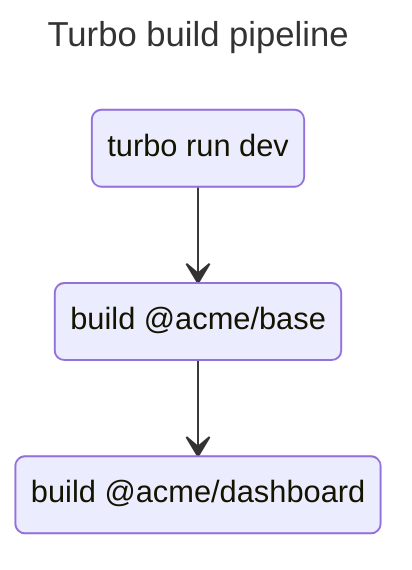
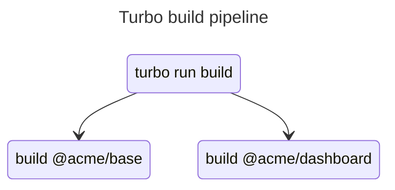
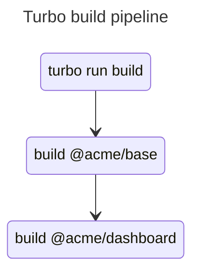
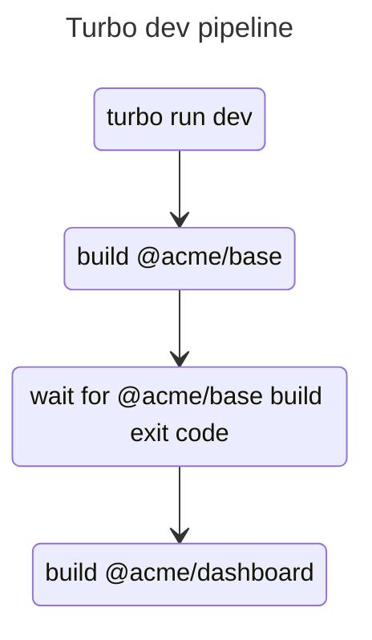

# Running turborepo dev in series

Running multiple `dev` tasks in parallel is a common necessity when working with a monorepo. It's also a common source of bugs.

Some monorepo tools allow you to run **persistent** tasks in series. This is useful when you have a package `dev` script that depends on another package `dev` script completing in the same repository.

Turborepo doesn't have this feature built-in for persistent tasks, but it's possible to achieve the same result using the `dependsOn` configuration.

## Setting up a Turborepo task pipeline

Turborepo uses your package manager, in our case [pnpm](https://pnpm.io/), to run tasks. You can run tasks from the root of the repository or from the directory of the package or application you want to run.

You define the tasks you want to run in the `turbo.json` file at the root of the repository.

```json
// turbo.json
{
  "pipeline": {
    "build": {
      "outputs": ["dist/**", ".next/**"] // these files will be cached
    },
    "dev": {
      "cache": false,
      "persistent": true // this task does not exit
    }
  }
}
```

The app/package must have that script defined in it's `package.json` in order for Turborepo to run it.

```json
// apps/dashboard/package.json
{
  "scripts": {
    "build": "react-scripts build",
    "dev": "react-scripts start",
  }
}

// packages/@acme/base/package.json
{
  "scripts": {
    "build": "rimraf dist/; sleep 5; preconstruct build",
    "dev": "rimraf dist/; sleep 5; preconstruct dev",
  }
}
```

In the `@acme/base` package, we've added a `sleep 5` command to simulate a long build process.

### Running tasks across the workspace

Let's imagine you are working on the `@acme/dashboard` application and the `@acme/base` package. We've configured `@acme/dashboard` to depend on `@acme/base` in its `package.json`.

```json
// apps/dashboard/package.json
{
  "dependencies": {
    "@acme/base": "workspace:*"
  }
}
```


If you run `turbo run build` from the root, you'd expect `@acme/base` to build first and `@acme/dashboard` to build second.

<!-- DIAGRAM -->


However, because **by default, Turborepo runs all pipelines in parallel**, `@acme/dashboard` will start building **before** `@acme/base` is finished. 



When you run `turbo run build`, it will run all the pipelines related to `build` at once. This means that `@acme/dashboard` will be using the previous build of `@acme/base` and not the one you are currently working on.

It's important to keep this in mind when building applications that depend on "core" packages.

### Running dependency's tasks first

Turborepo allows you to configure certain task to wait for other tasks to finish before running. This is done using the `dependsOn` configuration.

In the previous example, we could configure `@acme/dashboard` to wait for `@acme/base` to finish building before starting its development server. This would ensure that `@acme/dashboard` is using the latest build of `@acme/base`.

```json
{
  "tasks": {
    "build": {
      "dependsOn": ["^build"], // run dependencies build script first
      "outputs": ["dist/**", ".next/**"]
    },
}
```

And this works great for the `build` script. The `@acme/dashboard` package will run the `build` command **after** `@acme/base` build process exits.

<!-- DIAGRAM -->


But what about the `dev` script?

```json
{
  "tasks": {
    //...
    "dev": {
      "cache": false,
      "persistent": true,
      "dependsOn": ["^dev"] // run deps dev first
    }
  }
}
```

This won't work. Turborepo will throw an error saying that `@acme/base:dev` cannot be depended on.

```bash
$ turbo run dev
error: Invalid persistent configuration:
"@acme/base#dev" is a persistent task, "@acme/dashboard#dev" cannot depend on it
```

Turborepo **_doesn't allow you to depend on a persistent task_.** The `dependsOn` configuration will wait for all tasks to finish before running the next task, so you can't have `@acme/dashboard`'s `dev` depend on `@acme/base`'s `dev` task because it never ends.

### Forcing tasks to wait for persistent tasks

To get around this issue, you can create a task that waits for `@acme/base` to finish building before **exiting**, the `wait-dev` task. 

```json
// turbo.json
{
  "pipeline": {
    // ...
    "dev": {
      "dependsOn": ["^wait-dev", "build"],
      "cache": false
    },
    "wait-dev": {
      "cache": false
    }
  }
}
// packages/@acme/base/package.json
{
  "scripts": {
    "build": "rimraf dist/; sleep 5; preconstruct build",
    "wait-dev": "wait-on dist/@acme/base.js"
  }
}
```

The task will exit once the build files are present. This allows `@acme/dashboard` to depend on `@acme/base`'s `wait-dev` task, ensuring that `@acme/dashboard` is using the latest build of `@acme/base`.



Now, when resolving task dependencies, Turborepo will run `@acme/base`'s `wait-dev` and `build` tasks **concurrently**. It will then **wait for them all to emit an exit code** before running the `@acme/dashboard:dev` task.